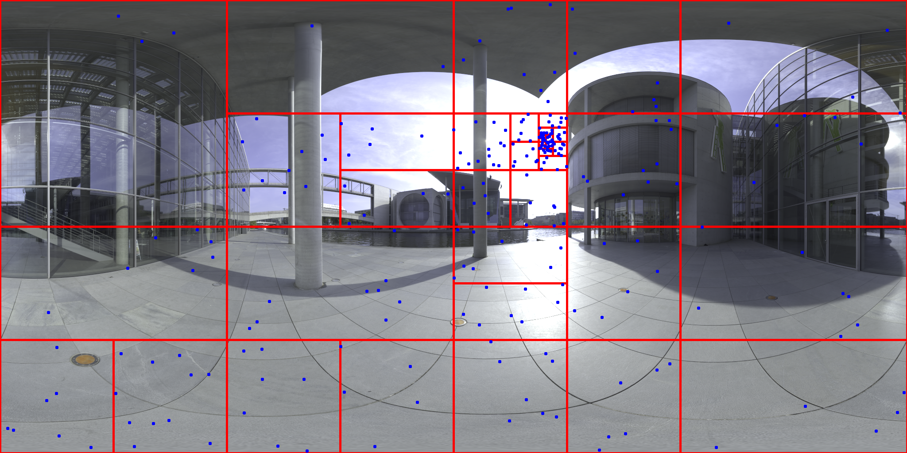

# Tiles generator for HDR environment maps

Splits an HDR env map into tiles/bins that roughly have the same radiance.

Red: generated bins - Blue: random samples using importance sampling by the tiles
  

These generated tiles can be used for importance sampling the environment map in a Monte Carlo Ray Tracer.
Each tile has is a 4-tuple of (x0, y0, x1, y1) which marks the absolute min and max values of a tile's area.

### Credits

The algorithm is from this blog post: http://karim.naaji.fr/environment_map_importance_sampling.html
